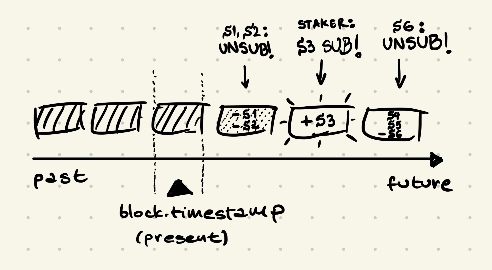

# Explainers

## Strategy

### Subscription Tracker

- Subscriptions are tracked with a linked list.
- Adding a Subscription with a unqiue end-time creates a new item and adds the Service to the item.
- Adding a Subscription with an existing end-time only adds the Service to the item.
- Removing a Subscription removes the Service from the item it is in.
- Removing a Subscrioption deletes the item if the removed Service was the last one it the item.
- If the Subscription is never removed, the item will eventually expire and the Subscription will end.

